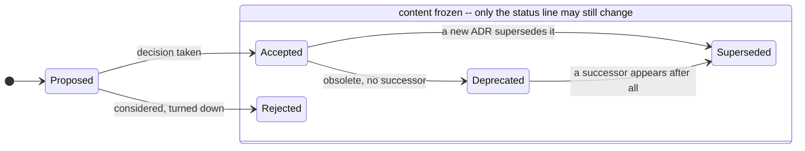

# /arknet:legacy-adr -- Architecture Decision Records (file-based, legacy)

> **Legacy skill.** This is the file-based predecessor of `/arknet:adr`, which now talks to
> arknet's `adr_*` MCP tools instead of the filesystem. Use this skill only for a project that
> still keeps its ADRs as Markdown under `docs/adr/` and has not migrated yet. For any project
> without that constraint, use `/arknet:adr`.

You maintain the Architecture Decision Records of the project you are working in --
conventionally `docs/adr/`, unless that project puts them elsewhere. Your single job: keep
every ADR a record of a **durable decision and its lasting consequences** -- never a status
report, never an implementation snapshot.

Two rules override everything else in this skill, and you apply them before any other
judgement:

1. **From `Accepted` on, an ADR is frozen.** Do not edit it, do not amend it, do not tidy
   it up -- only its status line may still change. If something is wrong or new: a new ADR
   that supersedes the old one. See "Immutability".
2. **Cross-references are written one-sidedly.** Never touch a second ADR just to maintain
   a back-reference -- the metamodel derives the reverse direction.

The authority here is not taste. It is arknet's ADR metamodel, class
`arkarch:ArchitectureDecisionRecord`, reproduced in full in the next section. If a sentence
has no home in a metamodel slot, it does not belong in the ADR.

## Adapt to the project, do not impose

This skill ships rules, not a house style. Before writing or reviewing, look at what the
project already does (`ls docs/adr/`, read one or two records) and match it:

- **Language.** Existing ADRs set it -- keep writing in theirs. Only if the project has no
  ADRs yet, use English, and use the English section names from the template below.
- **Section names.** Whatever the existing records use for the four metamodel slots. A
  German corpus reads `## Kontext / ## Entscheidung / ## Konsequenzen / ## Alternativen`;
  do not "correct" it to English.
- **Numbering, file naming, character set.** Follow the corpus. Only when nothing exists
  yet, fall back to the defaults in "Template".

What you do *not* adapt to is the substance: the slots, the litmus test, one decision per
record, immutability and one-sided references hold in every project. A corpus that violates
them is a finding, not a convention -- a corpus in which every record bundles three
decisions has a habit, not a house style.

## The metamodel defines the ONLY allowed content

These are the slots `arkarch:ArchitectureDecisionRecord` permits. There are no others.

| Metamodel slot | Meaning | Markdown section |
|----------------|---------|------------------|
| `dcterms:identifier` | number (mandatory, exactly 1) | filename + title |
| `arkarch:adrStatus` | exactly 1: Proposed / Accepted / Rejected / Deprecated / Superseded | `Status:` line |
| `arkarch:decisionDate` | date the decision was made | date in the `Status:` line |
| `arkarch:adrContext` | why did this have to be decided? forces and constraints | Context section |
| `arkarch:adrDecision` | the decision that was made | Decision section |
| `arkarch:adrConsequences` | positive and negative consequences of the decision | Consequences section |
| `arkarch:adrAlternatives` | options considered and rejected, with reasons | Alternatives section |
| `arkarch:relatedTo` | loose cross-reference -- written **one-sidedly** | `Related:` line |
| `arkarch:supersedes` | this ADR replaces an older one -- stated **only here**, in the new record | `Supersedes:` line |
| `arkarch:supersededBy` | inverse of `supersedes`, **derived, never maintained** | status line of the superseded ADR |
| `arkarch:addressesRequirement` | traceability to a requirement | optional, in Context/Decision |
| `arkarch:affectsContext` | bounded context affected | optional, in Context/Decision |

If you catch yourself writing an "Open points", "Implementation", "Status", "TODO",
"Current state", "Addendum" or "Next steps" section -- **stop**. No such slot exists. That
content belongs elsewhere (see below).

## One decision per record

A record holds exactly one decision. Before writing, and on every review, split the Decision
section into its separate assertions -- **not only where they are numbered; a second decision
hides in running prose far more often than in a numbered list** -- and apply the
**independence test** to each of them:

> **Could this point have gone the other way without changing the point before it?**
> Yes -> it is its own ADR.
> No  -> it is a facet of the same reversal and stays.

Numbering the parts of a decision is for facets of *one* reversal -- the pieces that all
fall together if the decision is taken back. Two decisions that could each have gone the
other way independently are two records, however closely together they were taken.

Telltale signs, each of them a finding:

- an "and" or a "+" in the title or the filename;
- a point that decides a *different kind* of thing than the title announces -- a trust
  boundary buried in a transport ADR is a decision nobody finds again;
- a Consequences section whose entries sort into two disjoint groups.

Why this is not cosmetics: **a bundled ADR cannot be superseded.** Reversing one half of it
leaves only bad options -- edit a frozen record, or supersede a decision that is still in
force. Granularity is what keeps "Immutability" workable at all.

On review this branches on status like every other finding (see "Immutability"): at
`Proposed`, split the record into one ADR per decision. From `Accepted` on, name the
bundling and offer the successor ADRs that separate it -- the bundled record itself stays
exactly as it is.

## Length and implementation detail

A record that grows has almost always taken on something that is not decision content.

- **Length is a question, not a limit.** A Decision section beyond roughly 30 lines, or a
  file beyond about two pages, obliges you to ask: is this two decisions (see "One decision
  per record"), or is it implementation detail? Answer that question explicitly -- noting
  the size and moving on is not enough.
- **No implementation detail.** No class names, method signatures, constructor arguments or
  literal parameter values in the decision text. `new ValidationOptions(true)` is not a
  decision; "validation is on by default, callers opt out explicitly" is. Name the decision
  and its rationale -- the code and the module docs carry the how, and unlike the ADR they
  stay correct when the code moves.

The distinction from the implementation *snapshot* (anti-pattern 1): a snapshot goes stale,
a detail may well stay true -- and still does not belong here, because it drags the record
down to a level at which every rename is a falsification.

## The litmus test (apply to every sentence)

> **Does this sentence go stale the moment someone changes code?**
> Yes -> out. It is wiring state, not decision content.
> No  -> it is a durable consequence and may stay.

Worked example -- the same fact in both forms:

- OUT (snapshot): "the transport currently pins the tenant to the default value, so in
  practice it runs single-tenant." Stale as soon as someone wires the real tenant through.
- STAYS (durable consequence): "No tenant management and no defined origin of the tenant id
  per session -- deliberately left open until the need is concrete."

Same decision, but one form is a decision record and the other is a status line pretending
to be one.

The test applies **while writing**, as long as the ADR is `Proposed`. From `Accepted` on it
is a diagnostic, not a repair tool: you name the snapshot, but you no longer remove it from
the record. See "Immutability".

## Anti-patterns -- the failure class to guard against

The recurring mistake is smuggling transient implementation state into a durable document.
Concretely, NEVER put these in an ADR:

1. **Implementation snapshot** -- "currently pinned to X", "solved for now via a local
   override in the build file", "only one adapter wired so far". Wiring state, not decision.
2. **Implementation detail** -- class names, method signatures, constructor arguments,
   literal parameter values. Even where they are durably true, they pin the record to a
   level at which every rename falsifies it. See "Length and implementation detail".
3. **Two decisions in one record** -- independently reversible points bundled into one ADR,
   often announced by an "and" in the title. See "One decision per record".
4. **Open-points / TODO list** -- open work is an issue, not an ADR section. (A *deliberately
   deferred* consequence with a reason is allowed -- that is a result of the decision, not a
   worklist.)
5. **Commit refs / PR numbers / file lines** -- "see commit fcfaf29", "in ModelLoader.java
   line 42". Transient; belongs in git or the tracker, not in the ADR.
6. **Addendum / amendment / update section** -- a heading like
   `## Addendum 2026-07-18: third consumer (issue #66, PR #133)` records that a decision was
   *applied again*. That is progress, not decision. Either it genuinely refines the decision
   -- then it is **its own ADR** superseding the old one -- or it belongs in the tracker.
   There is no third case. See "Immutability".
7. **"Implementation" / "Status" / "Next steps" section** -- no metamodel slot.
8. **The agent deciding by itself** -- an ADR records the decision of *the user*, not yours.
   If the decision has not been made yet: status `Proposed`, and name the openness in the
   context -- do not invent a decision to fill the slot.
9. **Empty / dutiful alternatives** -- "no alternatives considered" is a smell. If there
   genuinely was no alternative, briefly justify *why* the option space was empty.
10. **Marketing prose / filler** -- sober, dense, one thought per sentence.

## Where the excluded content belongs

Removing a snapshot does not mean discarding information -- only filing it in the right
place:

- **Wiring state / "why does the code look like this"** -> doc comment on the affected type.
- **Open work** -> the project's issue tracker.
- **Project progress / "done in commit X"** -> git history, release notes, the project's own
  notes.
- **"Decision now applied to Y as well"** -> the issue or PR that did it. A decision that
  holds needs no proof of it in the ADR -- it holds.

When you remove a snapshot from a `Proposed` ADR, check whether it is recorded elsewhere;
if not, say so (do not delete silently). From an `Accepted` ADR you remove nothing -- there
you only name the destination.

## Template

Defaults for a project that has no ADRs yet. A project with an existing corpus overrides
the language, the section names and the file naming -- see "Adapt to the project".

```markdown
# ADR-NNN: <concise decision title>

- Status: <Proposed|Accepted|Rejected|Deprecated|Superseded> (YYYY-MM-DD)
- Related: ADR-XXX, ADR-YYY      # omit if none; one-sided, no counter-entry over there
- Supersedes: ADR-MMM            # only if this ADR replaces an older one

## Context

Why did this have to be decided? Forces and constraints. References to related ADRs and --
where applicable -- to the requirement addressed or the bounded context affected.

## Decision

The decision, precise and in the active voice. One decision per record: number the parts
only where they are facets of the same reversal (independence test, see "One decision per
record"). No class names, no signatures, no literal parameter values.

## Consequences

**Positive:** durable benefits that follow from the decision.

**Negative / deliberately deferred (YAGNI):** durable costs and points left open on
purpose, *with reasons*. Not a worklist, not a snapshot.

## Alternatives

- **<Rejected option>.** One sentence on why it was rejected. `Rejected.` /
  `Rejected for now (revisitable).`
```

Template rules:
- **Filename:** `adr-NNN-<kebab-title>.md`, NNN three digits (`001`), consecutive. Before
  assigning a number: `ls docs/adr/` -- highest existing + 1.
- Only the four `##` sections above. Do not invent further headings -- in particular no
  `## Addendum`, `## Amendment`, `## Update`.
- **The title names one decision.** If it needs an "and" or a "+" to be accurate, you are
  writing two records.

A full worked record is shipped next to this skill: **`reference/adr-sample.md`**. Read it
before writing your first ADR in a project that has none -- it shows what a real
consequences section and substantive alternatives look like.

## Immutability -- an `Accepted` ADR is never touched again

This is a hard rule, not a recommendation. With `Accepted`, the content freezes: Context,
Decision, Consequences and Alternatives are **never** edited afterwards -- not sharpened,
not amended, not "just clarified", not reworded. An ADR records what was decided back then
and why; smoothing it over after the fact falsifies the minutes.

**The only permitted change is the status line**, and only in these directions:

```
- Status: Superseded (2026-07-28), superseded by ADR-042
- Status: Deprecated (2026-07-28)
```

Why the status line stays mobile while everything else freezes: ADRs get referenced from
the code, typically from doc comments. Someone arriving in the file from there must see
that the decision is dead without consulting the index first (see "The index"). A dead
decision that still
calls itself `Accepted` is more dangerous than any formatting violation.

What this means for you as a reviewer -- these repairs you may **not** propose and may not
apply to an `Accepted` ADR:

- "fold the addendum back into the decision sentence"
- "add consequence X, it has become clear since"
- "tighten the wording / drop the snapshot"

The fix in all three cases is the same: **a new ADR** superseding the old one. Name the
violation, say that the old record stays as it is, and offer the successor ADR.

Only at `Proposed` is the content freely editable -- nothing has been minuted yet. A
violation found in an `Accepted` ADR is still valuable: it belongs in the successor ADR,
not in a correction.

## Status lifecycle

The important line in this diagram is not between the states, it is around them: leaving
`Proposed` is the moment the content freezes.



- `Proposed` -- the only editable state. Date = today. **Name the condition for the
  transition explicitly** ("becomes Accepted once the licence is settled"). A `Proposed`
  without a transition condition is a smell.
- `Accepted` -- settled. From here "Immutability" applies.
  **Shipped means `Accepted`:** a decision that is built and in production is not
  `Proposed`, whatever the file still says. The status describes the decision, not the
  attention the file has had since.
- `Rejected` -- considered and turned down. Stays as documentation; that is the point of
  writing it down.
- `Deprecated` -- obsolete with no concrete successor.
- `Superseded` -- replaced by a named successor. The **new** ADR states
  `Supersedes: ADR-MMM`; in the old one **only the status line** changes, to
  `Superseded (date), superseded by ADR-NNN`. No addendum, no note, no entry in `Related:`.
  The index gets both lines updated (see "The index").

**The arrows that are missing, and why:**

- **Nothing leaves the frozen box.** No `Accepted -> Proposed` to reopen a decision, no
  `Rejected -> Accepted` to change your mind. Both are a new ADR that supersedes the old
  one. Reopening would rewrite the minutes.
- **No `Proposed -> Superseded`.** Superseding is for records that were minuted. A
  `Proposed` record overtaken by events is rewritten or dropped -- there is nothing to
  preserve yet.
- **No self-transition on `Accepted`.** "Accepted, refined" is not a state. It is the
  addendum, wearing a different hat.

`Deprecated -> Superseded` is the one late transition that is allowed: an obsolete decision
that eventually does get a successor. It changes the status line only, which is the one edit
the frozen box permits.

**Status hygiene**, to be checked across the whole corpus and not just per record: shipped
means `Accepted`; every `Proposed` names the condition under which it flips; a decision no
longer in force reads `Deprecated` or `Superseded (date), superseded by ADR-NNN` instead of
staying `Accepted` forever. A corpus in which nothing is ever deprecated is not a corpus
without obsolete decisions -- it is one whose statuses have stopped being maintained. Status
drift is a review finding; correcting a status line is the one repair a frozen record
permits.

## The index -- `docs/adr/README.md`

A project with ADRs carries an index, from the first record on. Writing an ADR touches two
files -- always, with no size at which the obligation starts.

One line per record: number, title, status, date, and the decision in a single sentence.

```markdown
| #   | Title                          | Status                  | Date       | Decision |
|-----|--------------------------------|-------------------------|------------|----------|
| 001 | <title>                        | Accepted                | 2026-01-14 | <one sentence> |
| 002 | <title>                        | Superseded by ADR-007   | 2026-02-03 | <one sentence> |
```

**The index is a derived view, not a source.** The status line inside the record is
authoritative. Where the two disagree, the record wins and the index gets corrected -- never
the other way round. That rule keeps the index from becoming a second hand-maintained truth
about the same fact -- the same reason cross-references are written one-sidedly.

Maintaining it:

- **Writing a new ADR** -> add its line, in the same step. An ADR without an index line is
  half-written.
- **Superseding or deprecating** -> the new record gets its line, and the old record's line
  gets the new status. Both are index edits; the frozen record itself only ever sees its
  status line change (see "Immutability").
- **Reviewing** -> you do not silently create or rewrite the index. A missing index, a
  missing line, or a status that disagrees with its record is a finding: report it, and
  offer to build it.

What the index does *not* do is carry the deadness of a decision on its own. A reader
arriving in a record from a code comment must see the status there. The index makes drift
visible across the corpus; it does not replace the status line.

## Cross-ADR consistency

A single good ADR is not enough -- the corpus has to hold together. When writing a new one
and when reviewing an existing one, read the *other* ADRs (`ls docs/adr/`, then read).
Check:

1. **Contradictions in substance.** Does this ADR decide something that contradicts another
   `Accepted`/`Proposed` ADR? If so, do not leave both standing silently -- name the
   conflict. Either the new one supersedes the old, or one of the two is wrong.
2. **Superseding lives in the new ADR.** Does this ADR replace an older one? Then the
   **new** ADR says `Supersedes: ADR-MMM`; in the old one only the status line changes (see
   "Immutability"). That is the whole obligation -- no back-reference, no note in the old
   record.
3. **Superseded/deprecated ADRs no longer claim validity.** A replaced ADR stays as history
   but must not sound as though its decision were still in force -- the status line has to
   make that clear. It is also the only means available: the body stays untouched and keeps
   speaking in the present tense.
4. **References are one-sided.** A cross-reference is written exactly once, in the record
   that makes the claim. The *citing* ADR names the related one under `Related:`; the named
   ADR gets **no** counter-entry. A missing back-reference is not a finding.
   Why: the metamodel derives the reverse direction itself -- `arkarch:supersededBy` is
   `owl:inverseOf arkarch:supersedes`, and `arkarch:relatedTo` is an `owl:SymmetricProperty`.
   A hand-maintained back-reference would be redundant, and it would force exactly what
   "Immutability" forbids: editing a frozen record.
   What remains: references must point at **existing** numbers. Dangling numbers are still
   a finding.
5. **No duplication.** Two ADRs deciding the same thing are a smell -- merge them (only
   while both are `Proposed`) or mark the older one `Superseded`. The opposite error is the
   more common one and is checked per record, not across the corpus: one ADR holding two
   decisions (see "One decision per record").

On finding a contradiction: report which two ADRs collide and in what, and propose a
resolution (supersede / correct / merge) -- do not guess.

## Mode: writing vs reviewing

**Writing a new ADR:**
1. Look at the corpus and match its conventions (see "Adapt to the project").
2. Determine the number (`ls docs/adr/`).
3. Has the decision actually been made? If not -> `Proposed`, name the openness in the
   context, do NOT invent it. If it is built and running -> `Accepted`.
4. Apply the independence test *before* writing: is this one decision or several? Several
   -> one record each (see "One decision per record").
5. Fill the template, apply the litmus test to every sentence, and keep implementation
   detail out (see "Length and implementation detail").
6. Link related ADRs -- **here only, one-sidedly**. The linked records stay untouched.
7. Check cross-ADR consistency (see the section above): does it contradict or supersede an
   existing ADR? If it supersedes, set **only the status line** of the old record to
   `Superseded (date), superseded by ADR-NNN` -- nothing else.
8. Update `docs/adr/README.md`: add the new record's line, and adjust the status of any
   record this one supersedes or deprecates (see "The index").

**Reviewing an existing ADR.** Step 0 is always the same: **read the status.** It decides
which repair is even on the table.

- `Proposed` -> content is freely editable. Fix findings directly -- including splitting a
  bundled record into one ADR per decision.
- `Accepted` / `Superseded` / `Deprecated` / `Rejected` -> frozen. **Report findings, do not
  repair them**; the fix is a successor ADR -- for a bundled record, one per decision. The
  only permitted change to the file is its status line. See "Immutability".

Checklist:
- [ ] Exactly the four sections, none invented (Open points / Implementation / Status /
      Addendum / Amendment)?
- [ ] **One decision?** Could any numbered point have gone the other way on its own? If yes,
      it is a second ADR. No "and"/"+" in the title, no point deciding a different kind of
      thing than the title announces?
- [ ] **Length:** Decision section under roughly 30 lines, file under two pages? If not, was
      the question "two decisions or implementation detail?" actually answered?
- [ ] **No implementation detail:** no class names, method signatures, constructor
      arguments, literal parameter values in the decision text?
- [ ] No trace of a post-acceptance edit: no addendum, no "update", no issue or PR number in
      the text? (failure class: progress instead of decision)
- [ ] Does every sentence survive the litmus test (no snapshot, no commit ref)?
- [ ] Status + date set, exactly one status?
- [ ] **Status hygiene:** is a shipped decision `Accepted` rather than `Proposed`, and a
      retired one `Deprecated`/`Superseded` rather than still `Accepted`?
- [ ] At `Proposed`: is the condition for moving to `Accepted` named?
- [ ] At `Superseded`: does the status line name the superseding ADR?
- [ ] Does Consequences hold actual *consequences* (not a restatement of the decision)?
- [ ] Are the alternatives substantive (not "none considered")?
- [ ] Number unique, filename consistent with the corpus?
- [ ] Cross-references pointing at existing numbers -- and *one-sided*, i.e. without a
      hand-maintained back-reference in the other record?
- [ ] Cross-ADR consistency: no contradiction with other ADRs, superseding stated in the new
      record, no duplication (see "Cross-ADR consistency")?
- [ ] Does `docs/adr/README.md` exist, does this record have a line in it, and does that
      line's status match the record's own status line? (report, do not fix silently)

On a violation: never rewrite silently -- name the violation (which failure class), then
branch on status. At `Proposed`: propose or apply the fix and say where the removed content
belongs. From `Accepted` on: say that the record stays as it is, and offer a successor ADR
-- even when the fix would be a one-liner. Especially then.

Two findings do not follow that branching, because neither touches frozen content:

- **A wrong status** is corrected on the status line itself, at any status -- that is the
  one edit the frozen box permits. But the status records *the user's* decision: report the
  drift and offer the change, do not flip a record to `Accepted` on your own reading of
  what is in production.
- **A bundled record** is reported per decision, not per file. Say which points are
  independent of each other and what the successor ADRs would decide -- one vague "this
  should be split" is the finding the corpus has already survived.
